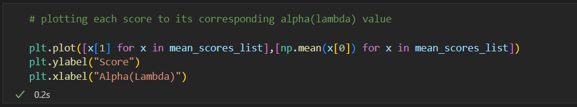

## Overview
Using Ridge regression with cross validation as a method of predicting body fat percentage in men from measurements taken from only a scale and tape measure.

## 1. Loading the data

Fig. 1

We import all libraries we are going to use at the start of the notebook.

Fig. 2

In order to load the body fat data csv file into a dataframe, we get the path to it (from the
same directory as the notebook) and save the dataframe to the variable data omitting the
first column(Fig. 2 ). We do this as the first columnof the csv file contains indices from 0
through 251 that we are not going to use as the pandas.DataFrame construct provides indices
automatically(Fig. 3 ).

Fig. 3

The data provided contains 17 columns of body measurements/metrics recorded for 252
men(rows).

## 2. Preprocessing

### 2.1. Removing outliers/wrong data

In order to remove any outliers that might skew the model’s prediction we create a plot of the
distribution of each column in the dataframedata(Fig. 4 ).

Fig. 4

From all 17 graphs and by looking at the csv file, we identify 3 outliers in the data that need
to be removed(Fig. 5 , Fig. 6 ).

Fig. 5

Fig. 6

If we look ath the csv file we can find that the Height (inches) outlier comes from entry 41,
where height is set to the unrealistic value of 29.5 (Fig. 7 ).

Fig. 7

The other 2 outliers we need to remove are entries 181 and 171. Both of them contain
unrealistic values of 0 and 0.7 for the Percent body fat... column(Fig. 8 ).

Fig. 8

We drop(remove) the aforementioned entries(41, 171,181) from the dataframe and confirm
that they have been removed by checking the shape ofdata with data.shape.

Fig. 9

*We can note that entry 215 displays considerably higher entries for Percent body fat and
the rest of the columns but they all fit each other and are therefore not considered as
outliers.

### 2.2. Feature Selection

Now that we have removed all outliers we drop the columns containing data that cannot be
measured or calculated only using a scale and measuring tape, as specified(Fig. 10 )

Fig. 10

The next step of feature selection is choosing which features can be eliminated based on
their correlation with the target. In order to display this we create a heatmap(Fig. 11 , Fig. 12).

Fig. 11

Fig. 12

The heatmap contains the correlation between all the columns of the dataframe represented
as numbers between -1 and 1. From this we decide to eliminate the columns of data with
the least correlation with Percent body fat, namely Age, Ankle circumference (cm), and
Forearm circumference (cm).(Fig. 13 )

Fig. 13

### 2.3. Standardization

Feature scaling is an important part of preprocessing. The data provided in the csv file uses
a wide range of measurements in different scales such as inches, cm, lbs, etc. Our data also
follows the normal distribution. Because of this we choose to standardize the data in each
column(Fig. 14 ).

Fig. 14
.

Fig. 15
We check that the standardization has been applied in Fig. 15.

## 3. Performing cross validation and ridge regression

We start by splitting the dataframe into target(Percent body fat) and features(the rest of
the body measurements)(Fig. 16 ).

Fig. 16

Then we prepare a list of possible alphas(λ) values in range 0 to 50 to try in our ridge
regression model and split the data in 5 with KFold. We also set shuffle=True in order to get
a better estimate from varying the data in the folds(Fin. 17 ).

Fig. 17

*Note: because of the shuffle, best alpha(λ) varies with the varying training/testing set but
primarily stays in the range 1 to 5.

Next, we perform cross validation. For each alpha we train a Ridge regression model with
that alpha, and then test it. The 5 (from 5 folds) tests are then scored and their mean saved
alongside the corresponding alpha(λ) we used. Finally, we find the highest mean score and
its corresponding alpha and display them(Fig. 17 ).That is how we determine the best
complexity parameter.

Fig. 17 Code template from (Bronshtein, 2022)

We can also show the optimal alpha(λ) by graphing the scores and their corresponding
alpha(λ)(Fig. 18 ). We can confirm that by looking atthe graph on Fig. 19. λ = 1.5 has the
highest score of 0.6933...

Fig. 18
.

Fig. 19

Now that we have chosen the best hyper-parameter λ, we apply the model for regression
purposes. In order to confirm that the model we have trained can predict Percent body fat,
we test that on the non-standardized data(Fig. 20 )and then plot the predictions against the
test values(Fig. 21 ).

Fig. 20

Fig. 21

In conclusion, using Ridge regression with cross validation is a viable method of predicting
body fat percentage in men and can be determined using only a scale and tape measure.

## References

Bronshtein, A. (2022) Train/test split and cross validation in Python, Towards Data Science.
Available at:
https://towardsdatascience.com/train-test-split-and-cross-validation-in-python-80b61beca4b
(Accessed: November 10, 2022).

Sklearn (2022) Sklearn.model_selection.Kfold, scikit. Available at:
https://scikit-learn.org/stable/modules/generated/sklearn.model_selection.KFold.html
(Accessed: November 10, 2022).

Sklearn (2022) Sklearn.linear_model.Ridge, scikit. Available at:
https://scikit-learn.org/stable/modules/generated/sklearn.linear_model.Ridge.html#sklearn.lin
ear_model.Ridge(Accessed: November 10, 2022).

Sklearn (2022) Sklearn.model_selection.train_test_split, scikit. Available at:
https://scikit-learn.org/stable/modules/generated/sklearn.model_selection.train_test_split.htm
l#sklearn.model_selection.train_test_split(Accessed:November 10, 2022).

Sklearn (2022) Sklearn.utils.shuffle, scikit. Available at:
https://scikit-learn.org/stable/modules/generated/sklearn.utils.shuffle.html(Accessed:
November 10, 2022).

